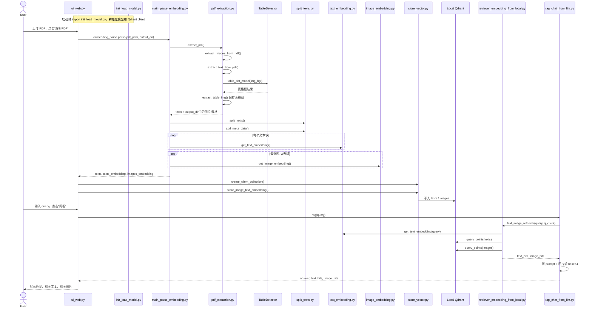

# Project Call Flow Analysis

## 1. 项目整体定位

这个项目实现的是一个典型的 PDF 多模态 RAG 流程：

1. 解析 PDF，提取文本、图片、表格
2. 对文本和图片分别做 embedding
3. 将 embedding 存入本地 Qdrant
4. 根据用户 query 检索相关文本和图片
5. 将检索结果和问题一起送给多模态 LLM 生成答案

它不是只有一个统一入口，而是由多个顶层脚本共同复用一套底层模块。

## 2. 主要入口文件

- `init_load_model.py`
  - 统一初始化模型和核心对象
  - 包括表格检测模型、文本 embedding 模型、图片 embedding 模型、Qdrant client
- `parse_and_store_embedding.py`
  - 离线解析 PDF，并把 embedding 写入向量库
- `retriever_embedding_from_local.py`
  - 本地检索测试入口
- `rag_chat_from_llm.py`
  - RAG 问答入口
- `ui_web.py`
  - Streamlit Web 入口，把“解析”和“问答”串起来

## 3. 初始化阶段

项目里最关键的公共入口其实是 `init_load_model.py`。

这个文件在被 import 时，就会完成以下初始化：

1. 创建 `TableDetector`
2. 创建 `PDFExtract`
3. 创建 `TextSplit`
4. 加载文本 embedding 模型 `TextEmbedding`
5. 加载图片 embedding 模型 `ImageEmbedding`
6. 创建解析编排器 `EmbeddingParse`
7. 创建本地向量库封装 `StoreVec`

也就是说，后面的 `parse_and_store_embedding.py`、`retriever_embedding_from_local.py`、`rag_chat_from_llm.py`、`ui_web.py`，本质上都在复用这里构造好的对象。

## 4. 文件调用主链路

### 4.1 解析并入库链路

从 `parse_and_store_embedding.py` 或 `ui_web.py` 的“解析PDF”按钮开始，主调用顺序如下：

`parse_and_store_embedding.py / ui_web.py`
-> `init_load_model.py`
-> `src/parse/main_parse_embedding.py`
-> `src/parse/pdf_extraction.py`
-> `src/table_det/inference.py`
-> `src/parse/split_texts.py`
-> `src/parse/text_embedding.py`
-> `src/parse/image_embedding.py`
-> `src/store/store_vector.py`

这条链路的职责可以拆成三段：

1. `pdf_extraction.py`
   - 提取 PDF 原始图片
   - 提取每页文本
   - 对每页做表格检测并裁剪出表格图片
2. `main_parse_embedding.py`
   - 调用文本切分
   - 调用文本 embedding
   - 遍历输出目录中的图片和表格做 image embedding
3. `store_vector.py`
   - 创建 Qdrant collection
   - 将文本向量写入 `texts`
   - 将图片/表格向量写入 `images`

### 4.2 检索链路

从 `retriever_embedding_from_local.py` 或 `rag_chat_from_llm.py` 开始，主调用顺序如下：

`retriever_embedding_from_local.py / rag_chat_from_llm.py`
-> `init_load_model.py`
-> `src/parse/text_embedding.py`
-> `src/store/store_vector.py` 中的 `q_client`
-> Qdrant 本地向量库

具体过程：

1. 先对用户 query 做文本 embedding
2. 用该向量分别检索 `texts` 集合和 `images` 集合
3. 返回最相关的文本片段和图片结果

### 4.3 RAG 问答链路

从 `rag_chat_from_llm.py` 或 `ui_web.py` 的“问答”按钮开始，主调用顺序如下：

`ui_web.py`
-> `rag_chat_from_llm.py`
-> `retriever_embedding_from_local.py`
-> Qdrant 检索
-> 多模态 LLM

具体过程：

1. `rag()` 先调用 `text_image_retriever()`
2. 得到 `text_hits` 和 `image_hits`
3. 取出图片路径并转成 base64
4. 将 query、检索文本、图片一起组装成消息
5. 调用 OpenAI 兼容接口生成答案
6. 将答案、相关文本、相关图片返回给上层 UI

## 5. Web 页面调用流程

`ui_web.py` 做了两件事：

### 左侧：PDF 解析

1. 上传 PDF
2. 保存到 `data/pdf/`
3. 点击“解析PDF”
4. 调用 `embedding_parse.parse()`
5. 调用 `store_vec.create_client_collection()`
6. 调用 `store_vec.store_image_text_embedding()`

### 右侧：问答

1. 输入 query
2. 点击“问答”
3. 调用 `rag(query)`
4. 展示最终答案
5. 展示命中的文本片段
6. 展示命中的图片

所以 `ui_web.py` 本身并不承担底层算法逻辑，它更像一个流程编排页面。

## 6. 时序图

## 7. 理解这个项目时最值得抓住的点

- `init_load_model.py` 是公共初始化中心
- `EmbeddingParse.parse()` 是“解析 + embedding”的总编排器
- `StoreVec` 负责把文本和图片向量写入本地 Qdrant
- `retriever_embedding_from_local.py` 是当前主流程实际使用的检索入口
- `rag_chat_from_llm.py` 负责把检索结果交给多模态 LLM
- `ui_web.py` 只是把前后两段流程串成页面

## 8. 一个容易混淆的点

仓库里有一个 `src/retriever/text_image_retriever.py`，看起来像正式检索模块，但当前主流程并没有直接使用它。

目前真正被 `rag_chat_from_llm.py` 调用的是顶层文件 `retriever_embedding_from_local.py` 里的 `text_image_retriever()` 函数。

所以如果你要顺着“真实执行路径”读代码，优先看：

1. `ui_web.py`
2. `rag_chat_from_llm.py`
3. `retriever_embedding_from_local.py`
4. `init_load_model.py`
5. `src/parse/main_parse_embedding.py`
6. `src/parse/pdf_extraction.py`
7. `src/store/store_vector.py`

